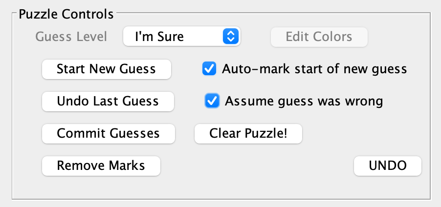

# PaintByNumberPro
## Purpose
The purpose of this program is to provide an interactive or automatic means of solving Nonograms, with emphasis on the ability to make and erase guesses easily.  Nonograms are also called Paint By Number, Griddlers, Hanjie, PicCross or Pic-a-Pix puzzles. 

#paintbynumber #griddler #hanjie #piccross #picapix #interactive #autosolver
## History
I love solving Nonograms.  But I have difficulty solving larger ones on paper and have never found a good way to manage making guesses and erasing the consequences of those guesses.  In 2010 I started writing this program in Java to give me a means of solving Nonograms that supported making guesses and testing the consequences of those guesses.  That naturally led to trying to write an automatic puzzle solver.  The code I wrote at that time got me part of the way there, but was particularly difficult to debug.  So I left it at a point where it would partially solve a Nonogram and then start using guesses to complete the puzzle.  This approach was very slow and didn't always lead to a solution in a reasonable amount of time.

In 2021, I decided to write a program that would help me extract the Nonogram clues from a scanned Nonogram.  That program is **PaintByNumber_OCR** which is in its own repository.  Now with new, larger puzzles to work with, I put this puzzle solver to the test.  I was quickly reminded that my old solver was less than stellar and I proceeded to rewrite some of the puzzle solving code.  The new code is much better than the old, but now we are left with a mix of my old and new code which may be a bit confusing to read.  But the end product is a fairly decent automatic solver that relies a little less on guessing.

Of note, there is one last shortcoming with the auto-solver.  I have noted it in the "Issues" and may get around to fixing it in the future.

For now, I hope you enjoy using this program to solve Nonograms.

## Code
This program was written entirely in Java 8 using NetBeans 8.2 on an Intel Mac running OS X 11.6 and does not require any additional libraries.  You can run this program on other platforms that support Java.  And you could work with the code using other IDEs.

## Getting Started
The `PaintByNumberPro.java` class file contains the main function to run.  You can either run this program through your IDE or your can double-click on the `PaintByNumberPro.jar` file in your `dist` folder.  The following window will appear:


If you click on `Open Puzzle...`, you will be selecting a .pbn file (really a text file) that contains a Nonogram or you can click on `Enter New Puzzle...` to create a new .pbn file by typing in all of the row and column clues.

You can also create a .pbn file by scanning or taking a photo of a Nonogram and using the **PaintByNumber_OCR** program to help you extract the clues.  The **PaintByNumber_OCR** program is in my other repository. 

### .pbn File Format
The format of a .pbn file is simple. It looks like this:

```
Source	Nonogram Book Puzzle 1
Rows	25
Cols	30
Row_clues	0	1	27
Row_clues	1	3	7	14	3
Row_clues	2	5	6	1	1	11	3
Row_clues	3	7	1	4	1	1	9	2	3
...
Row_clues	24	5	3	1	2	4	2
Col_clues	0	1	1
Col_clues	1	4	13	1	1	3
Col_clues	2	4	18	1	1	1
Col_clues	3	6	3	1	2	6	3	1
Col_clues	4	4	4	1	2	4
...
Col_clues	29	2	18	6
```

(The ... indicates that there are lines not shown). The first line contains the Source of the puzzle and is contains arbitrary text. The second and third lines tell you how many rows and columns there are in the puzzle. These are followed by the row clues and then the column clues. The 1st digit after Row_clues or Col_clues is the row or column number. It is followed by the number of clues for that row or column. And lastly come the clue values. Please keep these items in the order shown as the **PaintByNumberPro** program that reads the file is not particularly flexible.

Because this format is a text file, you can always create one by hand in any text editor.

### Creating a .pbn File Using OCR
You can create a .pbn file using OCR (Optical Character Recognition) using the **PaintByNumber_OCR** program in my other repository.  Using this program requires a little more setup because it uses Tesseract OCR and OpenCV.

### Creating a .pbn File
Click on the `Enter New Puzzle...` button:


Give your puzzle a name and enter the number of columns and rows.  Press `OK`.


This dialog gives you a means of typing in the clues (separated by spaces) in the middle text field.  Use the radio buttons to choose between row and column clues.  Move to the previous and next set of clues using the `<-` and `->` buttons.  When you have entered all of your clues, hit `Done`.  The program will do some basic error checking and will then give you the opportunity to save the new .pbn file.

This part of the code could be made a little more smart, but was provided just for convenience.

### Loading a .pbn File
Click on the `Open Puzzle...` button in the main window.  Choose your .pbn file.  The program will read and load the puzzle file.  If there are any errors in the .pbn file, you will be notified with a a dialog message.

## MainWindow
The following two windows appear after you have successfully loaded a .pbn file:


The particular puzzle shown was a freebie from Conceptis Puzzles.

You can use the puzzle window to interactively solve the puzzle (more instructions on this later).  The window on the left is used to control the appearance of the puzzle and gives you many options for saving, checking, and solving the puzzle using automated means.

### Controlling the Puzzle Appearance
The buttons in the lower right corner of the right window control the drawn appearance of the puzzle.  If you need to have the puzzle redrawn (maybe because part of the window didn't update), press the `Refresh` button.  The `Save Settings` button is not implemented.

### Saving and Printing
The buttons in the upper right corner of the right window will let you save the puzzle state into the original .pbn file or into a new .pbn file.  The file format becomes a little more complicated once it has been read into the **PaintByNumberPro** program as the state of each square (e.g. filled or not) and clue is now recorded in the file.  It remains a text file and you can always edit it to strip away the new information.

You can set the program to auto-save the puzzle every so many minutes.

You can print the puzzle onto a single sheet of paper by using the `Print` button.

If the window needs to be redrawn, press the `Redraw` button.

### Fixing Clues
The program will let you know if there is something wrong with the puzzle clues.  The sum of all clues in the column direction should be the same as the sum of all clues in the row direction.  You may also discover a problem with the clues when the auto-solver gets stuck and reports a problem.

If you think you need to fix the clues, click on the `Fix Puzzle Clues` button and you are given the opportunity to fix the puzzle clues.  It uses the same dialog as "Creating a .pbn File" which was described previously.

You can also use the **PaintByNumber_OCR** program to compare the clues with a scanned version of the puzzle.

## Interactively Solving the Puzzle
You can solve the Nonogram interactively as if you are using pencil and paper.

### Setting Squares
Clicking once on a square selects it (outlined in cyan).  Selecting it again will fill the square, then empty it (X) and then set it as unknown.  Note that the corresponding column and row of clues will also be outlined in cyan.  There is also a little purple line drawn to the right and bottom of the current row and column.

Pressing the `Return` key will also cycle through the different square states.

You can click and drag on a square to set a vertical or horizontal set of squares to the same status (filled or empty).  The number of contiguous filled squares is shown in a little floating window as shown below.


If you are working on an area of the puzzle for which the clues would be outside of the puzzle window, a floating window will appear with the clues as shown below.


### Marking Squares
If you right-click on a square, you get a pop-up menu which gives you several options.


The first option let's you "mark" a square.  A marked square will be outlined in blue.  You can also remove a marking or remove all markings.

The other options are discussed in the section below about using Guess Levels.

### Marking Clues
You can also mark clues.  First select a clue.  Its background will turn yellow.  Click again and the clue will turn red.  Click again and it will turn green.


### Using Guess Levels
Inevitably you reach a point where you need to make a guess and work from there.  That's when these controls become handy:



The Guess Level "I'm Sure" is the 0th level.  If you want to make a guess, click on the `Start New Guess` button and the Guess Level will switch to 1 (as indicated by the pull-down menu).  The next time you fill in a square or put in an X, it will be colored and its guess level will be marked.  Make sure the `Auto-mark start of new guess` checkbox is selected so that `Assume guess was wrong` will work properly, if selected.


If you reach the end of the line with your logic, you can set a new Guess Level and continue on.  Guess Levels start with the "I'm Sure" level (0) and continue upwards.

If you reach a point where you believe that your guess was incorrect, you use the `Undo Last Guess` button.  Note the checkbox to the right.  If you undo your last guess and you want the code to automatically invert your initial guess, leave this checkbox selected.  For example, if you initially guessed that a square was filled and now realize that it cannot be filled, this option will set that square to empty (X) when you undo your last guess.

If you believe that your guesses so far are correct, you can click on the `Commit Guesses` button and the squares will all be set to guess level 0 (i.e. "I'm Sure").

If you want to clear the puzzle and start over, select the `Clear Puzzle!` button.

`Remove Marks` removes all square markings (blue outlines).

`UNDO` will undo a variety of actions, including selecting and highlighting clues.

**Another note about using Guess Levels**: when you're working with guess levels, you can only modify squares that are at the same guess level as what is shown in the pull-down menu.  If you want to edit squares with a different guess level, you just use the pull-down menu to choose the corresponding guess level and proceed.

### Checking the Puzzle So Far

You can check to see if your solution so far contains any errors by clicking on the `Check for Errors` button in the `Hints and Clues` section of the right window.  Note that it is not checking if your solution so far is the correct solution, it is just checking to make sure that your solution does not contradict the clues.  Here our solution so far clearly doesn't work with the clues in the given row.


**Important Note**: row and column numbering start from 0 not 1!

### Checking your Solution

If you think you've solved the puzzle and you want to see if it is correct, click on the `Check My Solution` button.  All squares must be either filled or empty.

### Hints

If you need a hint, click on the `Give Me a Clue!` button.  The code will look for a square where it thinks it knows if it should be filled or empty and will tell you where that square is.  The current square will also be moved to this suggested square and will be outlined in cyan.  Again, this is based on your current solution and **not** on the actual solution (in case they are different).

## Auto-Solving the Puzzle

It's fun to let the code solve the Nonogram automatically by clicking on the `Auto Finish` button.


It will go as far as it can and then, if you do not have `Auto Stop` selected, it will start making guesses as needed until it has a complete solution for the puzzle.  You can click on the `Stop` button while it's in the middle of finding a solution.  And you can continue by selecting `Auto Finish` again.  You can also work on the puzzle interactively after the auto-solver has stopped.  For example if you are pretty sure that the solution so far is the correct one, you can use `Commit Guesses` and keep going.

It's also fun to select the `Auto Stop` check box and let the auto-solver work until it needs to make a new guess.  At this point, it will stop and you can work on the puzzle yourself.  Like in this example:


### Using the Pop-up Menus

There are different pop-up menus depending on where you click in the puzzle window.  As we've seen before, there is a pop-up menu when you right-click on a puzzle square:


The last 4 menu options are for starting a new guess, undoing the last guess, and committing the current guesses.  How these options behave will depend on how you have selected the checkboxes in the `Puzzle Controls` section of the puzzle control window.

If you right-click in the upper left region of the puzzle (where there are no clues), you get a different pop-up menu:


These are new options that hint at the auto-solver code under the hood.  The first option `Fill in obvious squares` will go through each row and column and execute what is called "Simple Boxes" as described in the Nonogram Wikipedia page [here](https://en.wikipedia.org/wiki/Nonogram) plus a little bit more.  This is the usual starting point for solving Nonograms.

Internally, the auto-solver then executes the last three processes over and over again until it can no longer make any changes.  At which point it needs to start guessing.  So `Process all edges` runs code that I wrote originally in 2010 that works without creating any errors.  It works from the edges inward.  But it was a tad limited, so in 2021 I wrote the `Process inner puzzle` functionality which works better and extends the abilities of the auto-solver.  You can execute these steps independently using the pop-up menu.  And you can execute them in any order.

And like the puzzle square pop-up menu, you can start a new guess and undo the last guess.  Additionally, you can choose the `Get & set next guess` menu item and the program will automatically choose the next square to set at the current Guess Level (if you are just getting started at that level) or the next higher Guess Level (if you've already set some squares at the current Guess Level).

If you right-click on the area with the clues, you will get a different pop-up menu.


For the row or column in which you right-clicked, you can run the `Auto fill` functionality.  This runs only the "Simple Boxes" approach for the row or column.  You can also run the `Process edges` functionality or the `Process inner line` functionality for just that row or column.

`Check line` will make sure that the solution you have so far is compatible with the clues.

## Debugging the Auto-Solver

The new code for the auto-solver, the code I call "Process inner line", may still contain bugs.  To try and make this process a little easier, I added the `Debug` checkbox. When you are running the auto-solver in debug-mode, the code will spit out a lot of diagnostics to standard out.  It is better to not turn on this option until you can first figure out when and where the error is occuring.  So step 1 would be: use the pop-up menus to mimic the auto-solver code until you can figure out which step caused the error.

Once you have identified which row or column and which step generated the error, start over and go through the processing steps up until the step **before** the one that causes problems.  Then select the `Debug` checkbox.  Then execute the next processing step.  At this point you can look at the output.  This text may be a bit obtuse because of the language I chose to use to described sequences of filled squares ("Blobs") and sequences of empty squares ("Anti-Blobs") and other such things.  But hey you're trying to debug my code!

The even more detailed approach to debugging this errant code is to execute the program in debug mode through your IDE.  Look for the `BetterPuzzleSolver.java` class and the `ProcessLine` method.  This is where the debugging mode is actually useful.  You'll see throughout this method that there are blocks of code like this:

```
if (do_debug)
{
    ... print some diagnostics to standard out
    noop();
}
```

You can either put breakpoints within these `do_debug` code blocks or you can put a breakpoint within the `noop()` method.  This will let you step through the process line auto-solver a little more slowly.

Hopefully there really are no remaining bugs in this functionality and we never have to do this sort of debugging again!

# Unfinished Code

Looking at the GUI for this program, I can see that there were some functions that I thought about implementing but never did.

## Create a new Puzzle

The ability to create a new Nonogram might be fun.  You could draw a pixel picture on a grid, generate the associated clues, and see if the puzzle was solvable by using the auto-solver.

## Edit Colors

If you ever try to solve a Nonogram that requires a lot of guessing, you will see that the program cycles through a bunch of colors as it increases the Guess Levels.  Someday it might be nice to edit these colors and also change the colors of various other settings like marking squares.

## Save Settings

This was meant to provide a way to save the current puzzle size and font settings to be reused as perhaps the default values for new puzzles.

# Ideas for the Future

It would be fun to extend this program so that you can work with color Nonograms.  This would be a fairly substantial change to the interface and the auto-solver.  It would also necessitate a change to the **PaintByNumber_OCR** program to handle clues with colors.
